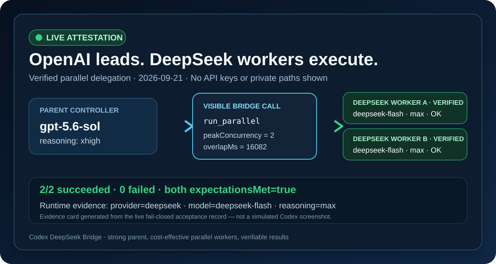

# Codex DeepSeek Bridge

[](https://github.com/zadyqs/codex-deepseek-bridge/actions/workflows/ci.yml)
[](LICENSE)

[](docs/VERIFIED_LIVE_PROOF.md)

> **强模型做难判断，外部 worker 做有界执行。** 本项目让顶层 Codex 通过可见的 MCP 调用，将合适的工程任务交给单独计费的 DeepSeek worker；结果由顶层独立审查、复测和提交。它旨在减少高能力模型承担的重复性工作，让有限的 Codex 使用额度更多留给架构、疑难问题与最终验收；**不保证任何固定的额度节省倍数，也不会改变账户的五小时窗口规则。**

已真实验证：`deepseek/deepseek-flash/high` 的双 worker 同步并行、运行时验真，以及持久化 Job 的提交、重连查询与结果回收。其他 provider/profile 只是架构兼容，未经各自端到端验真不宣称已支持。DeepSeek API 调用由用户自己的账户单独计费。

不做的事：不把 DeepSeek 加进 Codex 原生模型下拉菜单，不自动合并代码，不绕过 worker 沙箱，也不做万能路由器。相关 Codex 原生 provider 讨论见 [OpenAI 官方仓库 #29156](https://github.com/openai/codex/issues/29156)、[#35487](https://github.com/openai/codex/issues/35487)、[#40858](https://github.com/openai/codex/issues/40858)。

## 中文介绍

**让顶层模型负责判断，让高性价比模型并行干活。**

Codex DeepSeek Bridge 是一个可移除的 Codex 插件。它让 OpenAI 顶层模型负责拆解和把关，把边界清楚的工程任务交给 DeepSeek V4.1 Flash worker；短任务可同步并行，长任务可独立后台运行并持久化结果，再由顶层模型收回、复核与集成。

它不把 DeepSeek 伪装成 OpenAI 模型，也不修改 Codex 数据库、认证或内置模型目录。第三方模型目前仍通过独立 profile 与桥接调用协作；可见的 MCP 工具调用、真实并发时间和逐 worker 运行时验真，会记录任务实际由哪个模型完成。相关体验与讨论见 Codex 官方仓库 [#29156](https://github.com/openai/codex/issues/29156)、[#35487](https://github.com/openai/codex/issues/35487) 和 [#45839](https://github.com/openai/codex/issues/45839)。

**一次规划，多路执行；强模型把关，低成本扩编；调用可见，结果可证。**

## English

**Let the strongest model decide. Let cost-effective models execute in parallel.**

Codex DeepSeek Bridge is a removable Codex plugin. Keep premium Codex models focused on high-value reasoning while independently billed DeepSeek workers handle bounded implementation tasks. Short tasks use synchronous parallel calls; longer tasks use durable background jobs. Every worker is checked against runtime provider/model/reasoning evidence. This can make limited premium usage go further, but it does not change plan limits or promise measured savings.

**Plan once. Execute in parallel. Scale with value. Verify every result.**

## 它到底是什么？ / What exactly is it?

它不只是一个孤立的 MCP 配置，而是一套完整的 **Codex 插件**：

| 组成 | 作用 |
| --- | --- |
| Codex Plugin | 提供可安装、可升级、可卸载的产品外壳 |
| Local MCP Server | 提供同步 `run_parallel` 与持久化 `submit_jobs` / `get_job_status` / `collect_results` / `cancel_job`；`list_jobs` 可找回 job ID |
| Routing Skill | 告诉顶层模型何时拆任务、如何限制并发、如何回收结果 |
| Runtime Attestation | 从每个子任务的实际运行记录核验 provider、模型、推理强度和 CLI 版本 |
| Tests and Docs | 提供离线测试、真实 API 验收、回滚、故障排查和发布规范 |

所以最准确的说法是：**它是一个由本地 MCP bridge 驱动的 Codex 多模型并行插件。**

## 工作方式 / How it works

```text
OpenAI 顶层模型（规划、拆分、最终 Review）
                    │
                    ▼
     Codex DeepSeek Bridge / run_parallel 或 submit_jobs
          ┌─────────┼─────────┐
          ▼         ▼         ▼
     DeepSeek A  DeepSeek B  其他 profile
       编码         测试        文档/分析
          └─────────┼─────────┘
                    ▼
       运行时验真 → 结果回收 → 顶层模型整合
```

顶层模型始终保留架构决策、冲突处理和最终质量责任；worker 只处理明确、独立、受沙箱与超时约束的任务。这样既保留高能力模型的判断力，也能用更低成本扩大并行吞吐。

## 为什么值得用？ / Why it matters

- **成本分层：** 不必让昂贵的顶层模型亲自完成每一项机械工作。
- **真正并行：** 不是轮流模拟；返回峰值并发和任务重叠时间。
- **结果可证：** 不相信 profile 名称，直接核验运行时 provider、模型与推理强度。
- **失败关闭：** 实际模型不匹配时明确失败，不静默降级或偷换模型。
- **安全可逆：** 不接管 OpenAI 流量、不改数据库、不保存 API Key，随时可卸载。
- **不锁死 DeepSeek：** 每个任务可以指定不同 profile，为混合模型编队预留空间。

适合希望“强模型做架构和验收、性价比模型做批量实现”的个人开发者、小团队、长上下文代码库和批量工程任务。

## 能连接哪些模型？ / Provider compatibility

| 状态 | Provider / model | 说明 |
| --- | --- | --- |
| ✅ 已真实验证 | DeepSeek direct / `deepseek-flash` | DeepSeek V4.1 Flash；双 worker 端到端并行验收已通过 |
| 🟡 已预留接入 | OpenRouter profiles | 安装包已转发 `OPENROUTER_API_KEY`；具体模型必须逐个实测并验真 |
| 🟡 架构兼容 | 其他 Codex custom profiles | 需要可用的 Codex profile、Responses 兼容运行方式及对应密钥变量 |
| 🟡 接口支持、未实测组合 | 同批混合 profiles | 每个任务可覆盖 profile 和推理强度；每个 provider 都应单独端到端验真 |
| ❌ 不宣称 | “所有模型天然可用” | 配置存在不等于可用；只有真实调用和 attestation 通过才算支持 |

项目名称突出 DeepSeek，是因为它是当前的参考配置和已验证主力；执行核心本身是 provider-neutral。接入新 provider 时，只增加它所需的明确环境变量，不把密钥写入仓库，并先做最小真实调用。

## What works

- One call can launch 1-8 tasks, with 1-4 concurrent workers per call. Background jobs reserve at most four worker slots across active jobs.
- The default `deepseek` profile can be overridden per batch or per task.
- Each task can choose its own profile and reasoning effort, enabling mixed-provider batches.
- Worker execution is bounded by a timeout, output limit, cancellation signal, and `read-only` or `workspace-write` sandbox.
- For Git workspaces, a path inside the repository is promoted to the Git root, allowing workers to edit across the project tree while keeping the workspace-write boundary at that repository.
- Workers can edit and test files, while `.git` may remain read-only inside their sandbox. The parent agent should review the returned work and perform Git staging/commit from the parent task.
- Results include child thread IDs, provider/model/reasoning attestation, timing, concurrency, truncation state, and errors.
- Optional expected provider/model/reasoning fields fail the batch closed when runtime attestation differs.
- The known display alias `DeepSeek V4.1 Flash` canonicalizes to `deepseek-flash`; unknown friendly-name aliases fail closed. Other providers require exact model IDs.
- Credentials stay in environment variables and are screened from prompts and returned output.

In Codex, the parent task shows visible `codex_provider_workers.run_parallel` or `submit_jobs` tool calls. Those calls, followed by status/result collection, are the auditable delegation record.

## 两种执行模式 / Two execution modes

| Mode | Use it for | Lifecycle |
| --- | --- | --- |
| `run_parallel` | Short reviews, small edits, focused tests | One blocking call. The parent/tool call may end before a large task finishes; increasing worker timeout alone cannot prevent that. |
| `submit_jobs` | Feature-sized work that may outlive one MCP call | Returns a `job_id` promptly. A detached local supervisor continues after the MCP server/parent window closes. Query with `get_job_status`, recover IDs with `list_jobs`, read with `collect_results`, or stop with `cancel_job`. |

Job metadata and bounded results live in the current user's `~/.codex-worker-bridge/jobs/<job_id>/` (Windows: `%USERPROFILE%\.codex-worker-bridge\jobs\<job_id>\`). Prompts are held only in a private transient launch file, removed when the supervisor starts. Provider environment variables are not serialized, and known credential values in arguments are rejected; still, never put secrets in prompts. Protect this directory like other local development logs. This is a local single-user facility, not a cloud queue or a power-loss guarantee.

Timeout policies: `short=600s`, `feature=3600s` (default), `extended` requires explicit `timeout_seconds`; every job is capped at `7200s`. `run_parallel` retains its 30–1200s per-worker timeout. A worker timeout is `timed_out`; explicit cancellation is `cancelled`; provider/process/attestation failure is `failed`. An outer MCP/tool timeout is outside the background worker: retrieve the job ID through `list_jobs` and inspect it instead of assuming the worker stopped. A failed or cancelled `workspace-write` task may have left partial file edits; inspect the workspace before retrying.

For longer work, ask the parent to submit bounded tasks, then poll status and collect results. Do not block one tool call for the whole feature. The parent should review and rerun tests before committing.

## 与 Codex 原生体验协作 / Working alongside native Codex

The bridge keeps external-provider workers in explicit Codex profiles and routes them through visible MCP calls instead of changing the native picker. OpenAI's official Codex repository contains discussions about provider-aware Desktop selection in [#29156](https://github.com/openai/codex/issues/29156), provider/model pairing in [#35487](https://github.com/openai/codex/issues/35487), native subagent provider override in [#40858](https://github.com/openai/codex/issues/40858), and broader provider management in [#45839](https://github.com/openai/codex/issues/45839). These are upstream repository reports/discussions, not a promised fix schedule.

This project complements that work with an immediately usable, reversible path. It avoids database edits, traffic interception, fake authentication, and catalog replacement, and can be removed cleanly as native provider support expands.

## 看不到下拉菜单，怎么证明它真的工作？ / Proof without the picker

不要相信配置文件里写了什么，也不要把模型名称出现在界面上当成证明。一次有效验收必须同时看到：

1. 顶层 Codex 任务中出现可见的 `codex_provider_workers.run_parallel` 调用；
2. `peakConcurrency` 大于 1 且 `overlapMs` 大于 0，证明 worker 的确并行；
3. 每个结果的 `attestation.verified` 为 `true`，并由运行时报告 `provider=deepseek`、`model=deepseek-flash`、以及与请求相符的 `reasoningEffort`；
4. `expectationsMet=true`；provider、模型或推理强度只要有一项不符，桥接就失败关闭，而不是悄悄换模型。

The native picker is not the proof. The visible MCP call, real overlap, per-worker runtime attestation, and fail-closed expectations are the proof. See the [sanitized live acceptance record](docs/VERIFIED_LIVE_PROOF.md), including the exact results, independent child task IDs, reproduction prompt, and evidence boundaries.

## Requirements

- Codex CLI available on `PATH`
- Node.js 20 or newer
- A working Codex profile for each external provider
- Provider credentials stored in environment variables

DeepSeek's current official API model ID for DeepSeek-V4.1-Flash is `deepseek-flash`. See [DeepSeek's model and pricing page](https://api-docs.deepseek.com/quick_start/pricing/) and [Responses API reference](https://api-docs.deepseek.com/api/create-response/).

## Install

```powershell
git clone https://github.com/zadyqs/codex-deepseek-bridge.git
cd codex-deepseek-bridge\plugins\codex-deepseek-bridge
npm ci
npm run verify
cd ..\..
codex plugin marketplace add .
codex plugin add codex-deepseek-bridge@zadyqs
```

Restart Codex and start a new task so the plugin Skill and MCP tool are loaded. Provider setup is documented in [docs/PROVIDER_SETUP.md](docs/PROVIDER_SETUP.md).

## Example request

> Use Codex DeepSeek Bridge to give DeepSeek two independent tasks in parallel. Wait for both and show the runtime provider/model evidence.

The parent normally supplies:

```json
{
  "cwd": "C:\\absolute\\workspace",
  "profile": "deepseek",
  "reasoning_effort": "high",
  "expected_provider": "deepseek",
  "expected_model": "deepseek-flash",
  "expected_reasoning_effort": "high",
  "max_concurrency": 2,
  "sandbox": "workspace-write",
  "tasks": [
    { "id": "tests", "prompt": "Add focused tests for the parser." },
    { "id": "docs", "prompt": "Update the parser documentation." }
  ]
}
```

For DeepSeek V4.1 Flash, `high` is the recommended default for ordinary parallel workers; reserve `max` for clearly hard debugging, architecture, or final critical review. For mixed providers, put `profile` and optionally `reasoning_effort` on each task. The parent remains responsible for conflict-free task boundaries, integration, and final verification.

For a feature-sized task, ask: “Use `submit_jobs` with `timeout_policy=feature`, `reasoning_effort=high`, and expected `deepseek/deepseek-flash/high`; return the job ID, check status later, collect the result, then independently review and test before committing.” The default feature budget is one hour; use `extended` only with an explicit bounded timeout.

## Testing and review

```powershell
cd plugins\codex-deepseek-bridge
npm ci
npm run verify
npm run test:e2e
```

`npm run verify` is offline and safe for normal CI. `npm run test:e2e` makes real DeepSeek API calls and requires a configured `deepseek` profile, so it is intentionally opt-in. A manually triggered GitHub Actions workflow is provided for maintainers who add a `DEEPSEEK_API_KEY` repository secret. See [docs/TESTING.md](docs/TESTING.md).

## Documentation

- [v0.1.0 final release report](FINAL_RELEASE_REPORT.md)
- [Real SnakeBattle case study and evidence boundary](docs/SNAKEBATTLE_CASE_STUDY.md)
- [Architecture and trust boundaries](docs/ARCHITECTURE.md)
- [Provider setup](docs/PROVIDER_SETUP.md)
- [Testing and release gates](docs/TESTING.md)
- [Troubleshooting](docs/TROUBLESHOOTING.md)
- [Release process](docs/RELEASING.md)
- [Contributing](CONTRIBUTING.md)
- [Security policy](SECURITY.md)

## Adding another provider

Create a separate Codex profile containing the exact provider/model pair, validate that profile directly, then pass its profile name to `run_parallel`. The same Codex Desktop picker limitation generally applies to other custom providers.

The packaged MCP manifest forwards only `DEEPSEEK_API_KEY` and `OPENROUTER_API_KEY`. If a provider uses a different credential variable, add only that variable name to `.mcp.json`, rebuild, and reinstall. Never claim compatibility from configuration alone: set `expected_provider`, `expected_model`, and `expected_reasoning_effort`, then require a successful live attestation.

## 让更多开发者看到 / Help the project grow

如果这个项目帮你把“高能力总指挥 + 高性价比并行 worker”真正跑通：

- 给仓库一个 Star，让更多遇到相同 Codex provider 限制的人更容易找到它；
- 分享真实的 provider、模型和验真结果，但不要公开 API Key 或原始 rollout；
- 通过 Issues 提交可复现的问题、provider 兼容报告或改进建议；
- 欢迎贡献新的 provider 配置示例、测试与文档，所有“支持”声明都必须有真实调用证据。

**把昂贵推理留给关键判断，把批量执行交给可验证的高性价比模型。**

If the bridge helps, star the repository, share sanitized attestation evidence, and contribute reproducible provider reports. Every compatibility claim should be backed by a real call—not a configuration screenshot.

## Removal

```powershell
codex plugin remove codex-deepseek-bridge
codex plugin marketplace remove zadyqs
```

Removal does not delete provider profiles, environment variables, or Codex history.

## License

MIT
